# Computeflow

<p align="center">
  <picture>
    <source media="(prefers-reduced-motion: reduce)" srcset="assets/hero/hero-reduced.svg">
    <source media="(prefers-color-scheme: light)" srcset="assets/hero/hero-light.svg">
    
  </picture>
</p>

<p align="center">
  <picture>
    <source media="(prefers-reduced-motion: reduce)" srcset="assets/hero/computational-dark.svg">
    <source media="(prefers-color-scheme: light)" srcset="assets/hero/computational-light.svg">
    
  </picture>
</p>

**STATUS: EXPERIMENTAL**

Startup portfolio: computeflow

## Why it exists

> Based on live site (HTTP **200**):

## What is in it

| | |
| --- | --- |
| Source files | 49 |
| Test files | 0 |
| Documentation files | 13 |
| CI workflows | 0 |
| Build manifest | package.json |

Observed: 49 source file(s); build via `package.json`.

## Decisions

| Date | Decision | Why |
| --- | --- | --- |
| 2026-05-18 | No material product decisions logged this loop | Portfolio documentation batch only |

## Known limitations

Recorded failures, reproduced here rather than omitted:

| Area | Failure | Mitigation |
| --- | --- | --- |
| 2026-05-18 | none this loop | n/a |

## Build and run

```bash
pnpm install
pnpm build
pnpm test
```

## Evidence

Counts above are counted from the repository tree, not asserted. Where a value could not be measured it is omitted rather than estimated.

---

Part of the DUNG30N5 × NOAERTH portfolio. Repository: [`M4G3LL4N0/computeflow`](https://github.com/M4G3LL4N0/computeflow).
